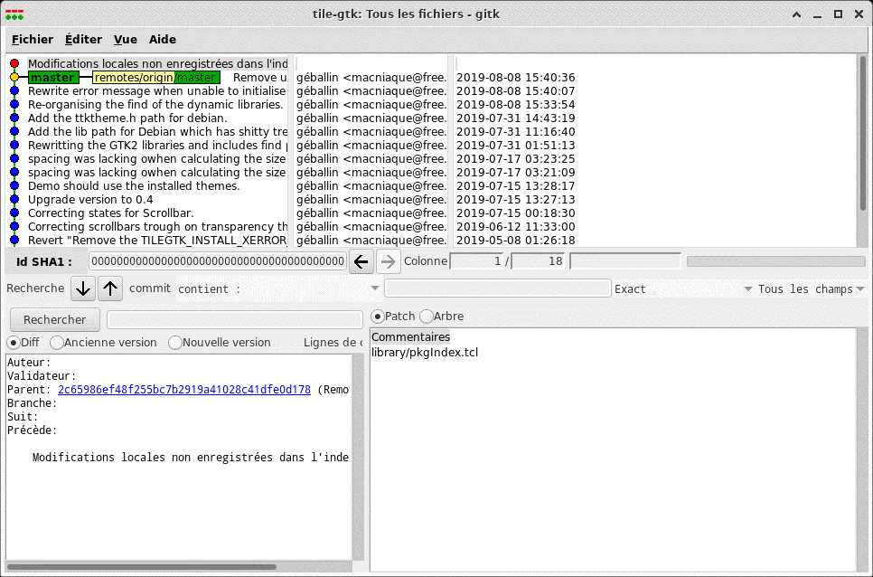
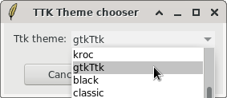

gtkTtk
========

gtkTtk is a [ttk](http://wiki.tcl.tk/14796) theme that gives to your [Tk](http://wiki.tcl.tk/477) applications a native [GTK+](http://www.gtk.org/) look and feel.
So applications made using TCL/Tk, Perl/TK or Python/Tkinter can now look as good as if they were written in C/GTK+ and integrate perfectly in Gnome or XFCE desktops.

**gitk, git gui and other popular TK applications will no more looks like comming from the 90's !**

gtkTtk is a fork of tile-gtk.
Since [according to the author][1] tilegtk as well as tileqt is
undermaintained, I created this fork to integrate my improvements and bugfixes and finishing the work to have a complete GTK+ look on ttk applications.

## Installation

    cmake -DCMAKE_INSTALL_PREFIX=`tclsh <<< 'puts [lindex $auto_path end]'`
    make
    make install
(sudo make install if you're not root)

## Selecting gtkTtk as default ttk theme

The easiest way is to install [ttk-theme-chooser](https://github.com/Geballin/TTK-Theme-chooser)
And select gtkTtk as your ttk theme :

[1]: http://www.tclcommunityassociation.org/wub/proceedings/Proceedings-2010/GeorgePetasis/TileQtAndTileGTK.pdf
